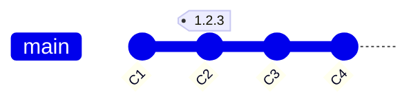
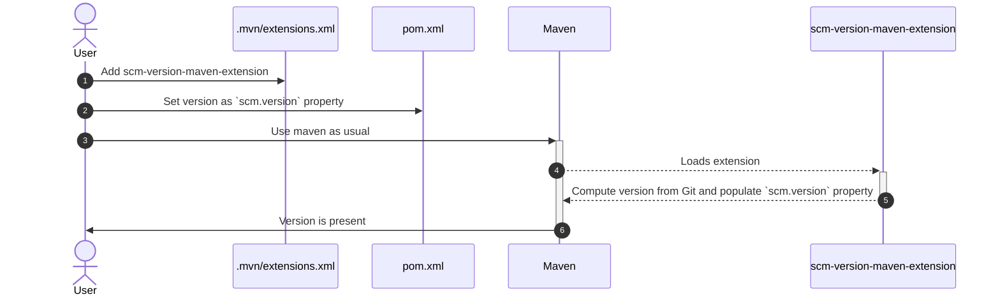

# SCM Version Maven Extension
A maven 4 extension to manage project version from SCM (GIT) in a simple way

# What is it for?
- Tracking project version from SCM (GIT) instead of explicitly being written in POMs.
- The extension does only one thing, compute the version and set it to `scm.version` property.
- The extension is intended to be simple if it does not meet your requirements please check these awesome projects
  - [Maveniverse Nisse](https://github.com/maveniverse/nisse)
  - [jgitver-maven-plugin](https://github.com/jgitver/jgitver-maven-plugin)
  - [maven-git-versioning-extension](https://github.com/qoomon/maven-git-versioning-extension)
  - [ci-friendly-flatten-maven-plugin](https://github.com/outbrain-inc/ci-friendly-flatten-maven-plugin)

# Setup

> [!IMPORTANT]  
> This extension only works with Maven 4

1. scm-version-maven-extension is a core extension, to be used it must be registered by adding it into `.mvn/extensions.xml` file
```xml
<?xml version="1.0" encoding="UTF-8"?>
<extensions>
    <extension>
        <groupId>dev.pretsa</groupId>
        <artifactId>scm-version-maven-extension</artifactId>
        <version>VERSION</version>
    </extension>
</extensions>
```

2. Project version must be set to `scm.version` on POM
```xml
<?xml version="1.0" encoding="UTF-8"?>
<project xmlns="http://maven.apache.org/POM/4.1.0"
         xmlns:xsi="http://www.w3.org/2001/XMLSchema-instance"
         xsi:schemaLocation="http://maven.apache.org/POM/4.1.0 http://maven.apache.org/xsd/maven-4.1.0.xsd">
    <modelVersion>4.1.0</modelVersion>

    <groupId>com.example</groupId>
    <artifactId>my-app</artifactId>
    <version>${scm.version}</version>

</project>
```

3. Use maven as usual, the extension will resolve `scm.version` property to the desired version on each run
```
[INFO] scm-version-maven-extension loaded
[INFO] scm.version property computed to [1.2.4-SNAPSHOT] as the [NEXT PATCH SNAPSHOT]
```

4. Debug level logging can be enabled to get more information by passing `-Dmaven.logger.log.dev.pretsa=debug` to maven
```
[INFO] scm-version-maven-extension loaded
[DEBUG] Working directory is /project/path
[DEBUG] No user defined property for version type, value set to NEXT
[DEBUG] No user defined property for next version component, value set to PATCH
[DEBUG] No user defined property for version qualifier, value set to SNAPSHOT
[INFO] scm.version property computed to [1.2.4-SNAPSHOT] as the [NEXT PATCH SNAPSHOT]
```

# How to use
To keep it simple the extension assumes that
- The project version is in [Semantic Version](https://semver.org/) style (MAJOR.MINOR.PATCH) .e.g. `1.2.3`
- The project version has only two variant
  - RELEASE which has no suffix e.g. `1.2.3`
  - SNAPSHOT which has `-SNAPSHOT` suffix e.g. `1.2.3-SNAPSHOT`
- The extension only work with annotated Git tags


# Common warnings

> [!INFO]  
> When the extension is not able to load current project version from scm, a default version of `0.0.0` is assumed and a warning is logged.


- Project path is not a valid git repository
```
[WARNING] Error loading tag at /project/path: One of setGitDir or setWorkTree must be called.
```

- Project repository does not have any commits yet
```
[WARNING] Error loading tag at /project/path: Ref HEAD cannot be resolved
```

- Project git repository does not contain any tags matching a semantic version pattern
```
[WARNING] Error loading tag at /project/path: No git tag matching supported glob [*[0-9]*.[0-9]*.[0-9]*]
```


# How it works

## The extension has 3 main options that can be combined to get the desired behaviour

### 1. Version type: This tells the extension what version to compute 
- Defaults to `scm.next` if no option is supplied

| Version type | Activate with | Description           |
|--------------|---------------|-----------------------|
| CURRENT      | scm.current   | The *current* version |
| NEXT         | scm.next      | The *next* version    |


### 2. Next version component: When version type is NEXT, this tell the extension what version component to increment
- Defaults to `scm.patch` if no option is supplied

| Version type | Activate with | Description                                 |
|--------------|---------------|---------------------------------------------|
| PATCH        | scm.patch     | The patch component e.g. `1.2.3` -> `1.2.4` |
| MINOR        | scm.minor     | The minor component e.g. `1.2.3` -> `1.3.0` |
| MAJOR        | scm.major     | The major component e.g. `1.2.3` -> `2.0.0` |


### 3. Version qualifier (variant): This tells the extension what variant to compute
- Defaults to `scm.snapshot` if no option is supplied

| Version type | Activate with | Description                                                              |
|--------------|---------------|--------------------------------------------------------------------------|
| RELEASE      | scm.release   | Will compute the version without any suffix e.g. `1.2.3`                 |
| SNAPSHOT     | scm.snapshot  | Will compute the version adding `-SNAPSHOT` suffix e.g. `1.2.3-SNAPSHOT` |

## Shorthand options
- Shorthand options are available for easier usage

| Shorthand option        | Equivalent options                  |
|-------------------------|-------------------------------------|
| scm.next.patch.release  | scm.next + scm.patch + scm.release  |
| scm.next.minor.release  | scm.next + scm.minor + scm.release  |
| scm.next.major.release  | scm.next + scm.major + scm.release  |
| scm.next.patch.snapshot | scm.next + scm.patch + scm.snapshot |
| scm.next.minor.snapshot | scm.next + scm.minor + scm.snapshot |
| scm.next.major.snapshot | scm.next + scm.major + scm.snapshot |

## Example
With that in mind, having a Git repository with the illustrated structure.


- Current release version will compute the version to `1.2.3`
```
mvn verify -Dscm.current -Dscm.release
```
- Current snapshot version will compute the version to `1.2.3-SNAPSHOT`
```
mvn verify -Dscm.current -Dscm.snapshot
```
- Next patch snapshot version will compute the version to `1.2.4-SNAPSHOT` 
```
mvn verify -Dscm.next -Dscm.patch -Dscm.snapshot
``` 
- Next patch snapshot version (shorthand) will compute the version to `1.2.4-SNAPSHOT`
```
mvn verify -Dscm.next.patch.snapshot
``` 
- Next patch release version will compute the version to `1.2.4`
```
mvn verify -Dscm.next.patch.release
``` 
- Next patch release version (shorthand) will compute the version to `1.2.4`
```
mvn verify -Dscm.next.patch.release
``` 
- Next minor release version will compute the version to `1.3.0`
```
mvn verify -Dscm.next -Dscm.minor -Dscm.release
``` 
- Next minor release version (shorthand) will compute the version to `1.3.0`
```
mvn verify -Dscm.next.minor.release
``` 




